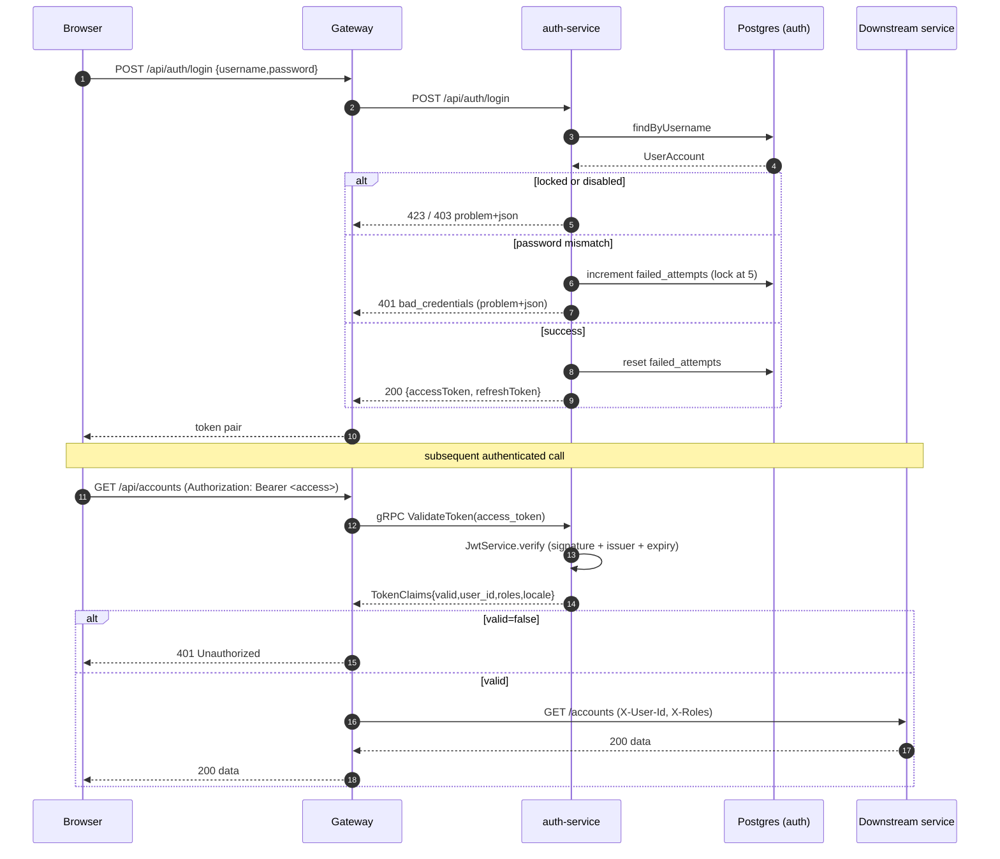

# auth-service — architecture & design

## Role in the platform

`auth-service` is SecureBank's **identity authority**. It is the only component that
knows the JWT signing key. Browsers authenticate through the gateway, which forwards
REST calls to this service; every *other* service (and the gateway itself) verifies
tokens by calling this service over gRPC rather than parsing JWTs themselves.

```
Browser ──REST──► gateway ──REST /api/auth/*──► auth-service (issues JWT)
                     │
   every authenticated request:
                     └──gRPC ValidateToken──► auth-service (verifies JWT)
                                                 │ returns decoded claims
                     ◄───────────────────────────┘
   gateway forwards X-User-Id / X-Roles ──REST──► account / transaction / … services
```

### Why a central gRPC validator? (trusted internal authority pattern)

If the signing secret were shared with every service, a leak anywhere would compromise
the whole platform, and each service would re-implement JWT parsing (drift, bugs,
inconsistent expiry handling). Instead:

- **One key, one place.** Only auth-service holds `SECUREBANK_JWT_SECRET`.
- **One verification path.** `JwtService.verify()` is used both by REST refresh and by
  the gRPC `ValidateToken` RPC, so they can never disagree.
- **Small trusted claims.** `ValidateToken` returns `TokenClaims` (user id, username,
  roles, locale). The gateway turns these into trusted `X-User-Id` / `X-Roles` headers
  on the internal network. Downstream services trust those headers and never see a JWT.
- **Rotation is local.** Rotating the key only touches this service.

## Layering (design patterns)

| Layer | Type | Responsibility |
|-------|------|----------------|
| `controller` | `@RestController` | HTTP only; validation via `@Valid`. Thin. |
| `grpc` | `@GrpcService` (Adapter) | Translates proto ⇄ domain; no business rules. |
| `service` | `@Service` (application service) | Use-cases + transaction boundary + lockout policy. |
| `security` | `JwtService` | Sole owner of mint/verify + signing key. |
| `repository` | Spring Data JPA (Repository) | Persistence of `UserAccount`. |
| `entity` | JPA entity | `users` table; optimistic-locked via `@Version`. |
| `dto` | records | Immutable request/response shapes (≠ entities). |
| `exception` | `@RestControllerAdvice` | Centralised RFC-7807 mapping + i18n. |
| `config` | `@Configuration` | Security, i18n, externalised `JwtProperties`. |

Other patterns: **static factory methods** (`AuthErrors`, `TokenResponse.bearer`),
**externalised configuration** (`JwtProperties` bound from `securebank.jwt.*`), and a
touch of **rich domain model** (`UserAccount.isLocked()`).

## JWT design

- Algorithm **HS256** (HMAC-SHA256); key derived from `SECUREBANK_JWT_SECRET`
  (must be ≥ 32 bytes — enforced by jjwt at startup).
- Claims: `iss=securebank`, `sub=<userId>`, `username`, `roles=[ROLE_…]`,
  `locale=en|hi|mr`, `type=access|refresh`, `iat`, `exp`.
- Access TTL 15 min; refresh TTL 7 days (configurable). `refresh` rotates both tokens.
- Verification requires a valid signature **and** `iss=securebank`. Failure is an
  expected outcome (returns empty / `valid=false`), not an exception.

## Account lockout policy

5 consecutive failed logins → account locked for 15 minutes (`locked_until`). A
successful login resets `failed_attempts` and clears the lock. Counters live on the
user row and are protected by JPA optimistic locking, so concurrent attempts can't lose
an increment. "Unknown user" and "wrong password" both return the same vague
`bad_credentials` to prevent username enumeration.

## Internationalisation

`MessageSource` loads `i18n/messages{,_hi,_mr}.properties` (UTF-8, real Devanagari). The
request locale comes from `Accept-Language` (the gateway forwards the user's preferred
locale), restricted to en/hi/mr, default en. Both RFC-7807 error details and Bean
Validation messages are localised.

## Login sequence (REST + gRPC)



## Build & token-stub generation

Protos are vendored in `src/main/proto/`; `protobuf-maven-plugin` (with
`os-maven-plugin` for the protoc classifier) generates message + gRPC stubs into
`target/generated-sources` during `mvn compile`. protobuf-java 3.25.x, grpc 1.65.x per
spec. No remote contracts jar is required.
